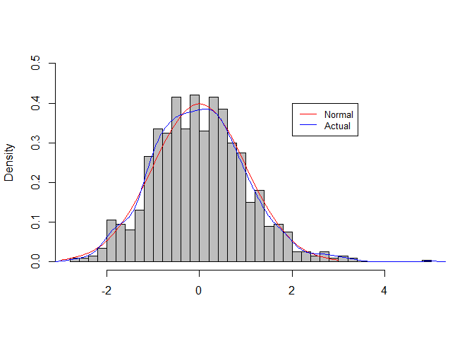

# Statistical Inference Course Project, Part 1: Simulation Exercises
Soumya Ghosh  
2015-04-25  

### Overview:
This course project report looks at a series of exponential distribution iterations, and compares the result set to a normal distribution and the theoretical mean and variance. 

### Simulations
The exponential distribution can be simulated in R with `rexp(n, lambda)` where `lambda`($\lambda$) is the rate parameter. The mean of exponential distribution is $1/\lambda$ and the standard deviation is also $1/\lambda$. For this simulation, we set $\lambda=0.2$. In this simulation, we investigate the distribution of averages of 40 exponential(0.2)s. 
Lets start by doing a thousand simulated averages of 40 exponentials.  

```r
# Set seed
set.seed(820)
lambda <- 0.2
# We perform 1000 simulations with 40 samples 
sample_size <- 40
simulations <- 1:1000

# Lets do 1000 simulations and calculate averages of 40 exponentials
means <- data.frame(x = sapply(simulations, function(x) {mean(rexp(sample_size, lambda))}))
```

### 1. Sample Mean versys Theoretical Mean
  

```r
# mean of distribution of averages of 40 exponentials
mean(means$x)
```

```
## [1] 4.998812
```

```r
# mean from theoretical expression
1/lambda
```

```
## [1] 5
```


### 2. Sample Variance versus Theoretical Variance  

```r
# standard deviation of distribution of averages of 40 exponentials
sd(means$x)
```

```
## [1] 0.7909422
```

```r
# standard deviation from theoretical expression
(1/lambda)/sqrt(sample_size)
```

```
## [1] 0.7905694
```

```r
# Variance of the sample mean
var(means$x)
```

```
## [1] 0.6255895
```

```r
# Theoritcal variance of the distribution
1/((lambda*lambda) * sample_size)
```

```
## [1] 0.625
```
  
Therefore, the variability in distribution of averages of 40 exponentials is close to the theoretical variance of the distribution.  
The variance of sample means is 0.6255895 where as the theoretical variance
of the distribution is $\sigma^2 / n = 1/(\lambda^2 n) = 1/(0.04 \times 40)$ =
0.625.  


### 3. Distribution : Show that the distribution is approximately normal.
Due to the central limit theorem, the averages of samples follow normal distribution. The figure below shows the density computed using the histogram and the normal density plotted with theoretical mean and variance values.  

```r
hist(scale(means$x),probability=T,main='',ylim=c(0,0.5),xlab='', col='gray', nclass = 40)
curve(dnorm(x,0,1),-3,3, col='red',add=T) # normal distribution
lines(density(scale(means$x)),col='blue') # actual distribution 
legend(2,0.4,c('Normal','Actual'),cex=0.8,col=c('red','blue'),lty=1)
```

 

