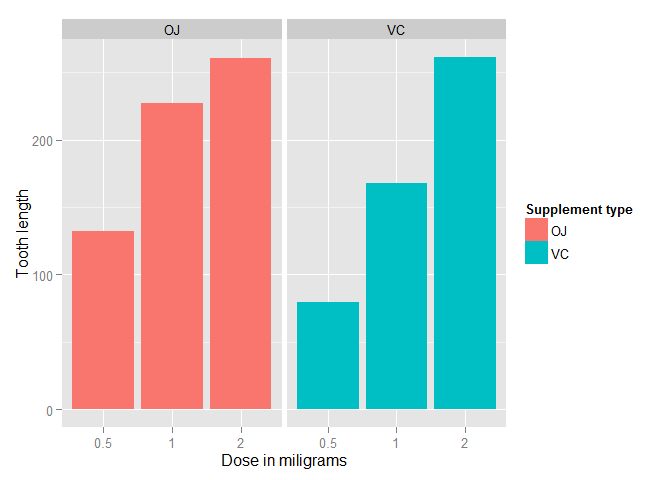

# Statistical Inference Course Project, Part 2: Basic Inferential Data Analysis
Soumya Ghosh  
2015-04-25  

In the second part of the project, we analyze the `ToothGrowth` data in the R
datasets package. The data is set of 60 observations, length of odontoblasts
(teeth) in each of 10 guinea pigs at each of three dose levels of Vitamin C
(0.5, 1 and 2 mg) with each of two delivery methods (orange juice or ascorbic
acid).

### 1. Load the ToothGrowth data and perform some basic exploratory data analyses 

```r
library(ggplot2)
library(datasets)
data(ToothGrowth)
head(ToothGrowth)
```

```
##    len supp dose
## 1  4.2   VC  0.5
## 2 11.5   VC  0.5
## 3  7.3   VC  0.5
## 4  5.8   VC  0.5
## 5  6.4   VC  0.5
## 6 10.0   VC  0.5
```

 

As can be seen above, there is a clear positive correlation between the tooth length and the dose levels of Vitamin C, for both delivery methods.

### 2. Provide a basic summary of the data.  
  

```r
# summary statistics for all variables
summary(ToothGrowth)
```

```
##       len        supp         dose      
##  Min.   : 4.20   OJ:30   Min.   :0.500  
##  1st Qu.:13.07   VC:30   1st Qu.:0.500  
##  Median :19.25           Median :1.000  
##  Mean   :18.81           Mean   :1.167  
##  3rd Qu.:25.27           3rd Qu.:2.000  
##  Max.   :33.90           Max.   :2.000
```

```r
# split of cases between different dose levels and delivery methods
table(ToothGrowth$dose, ToothGrowth$supp)
```

```
##      
##       OJ VC
##   0.5 10 10
##   1   10 10
##   2   10 10
```

### 3. Use confidence intervals and/or hypothesis tests to compare tooth growth by supp and dose.
#### *Compare Dosage Alone*

```r
t1<-subset(ToothGrowth,dose==0.5)$len
t2<-subset(ToothGrowth,dose==1.0)$len
t<-t.test(t1,t2,paired=FALSE,var.equal=FALSE)
t$conf.int[1:2]
```

```
## [1] -11.983781  -6.276219
```
If we increase the Vitamin C dose from 0.5 to 1.0 milligrams, the confidence interval does not contain zero, so we can reject the null hypothesis that this dose increase does not increase tooth length.


```r
t1<-subset(ToothGrowth,dose==1.0)$len
t2<-subset(ToothGrowth,dose==2.0)$len
t<-t.test(t1,t2,paired=FALSE,var.equal=FALSE)
t$conf.int[1:2]
```

```
## [1] -8.996481 -3.733519
```
Next, if we increase the Vitamin C dose from 1.0 to 2.0 milligrams, the confidence interval again does not contain zero, so we can reject the null hypothesis that this dose increase does not increase tooth length.

#### *Compare Supplement Alone*

```r
VC <- subset(ToothGrowth, supp=='VC')
OJ <- subset(ToothGrowth, supp=='OJ')
t<-t.test(VC$len,OJ$len, paired=FALSE,var.equal=FALSE)
t$p.value
```

```
## [1] 0.06063451
```

```r
t$conf.int[1:2]
```

```
## [1] -7.5710156  0.1710156
```
In this single comparison, the p-value is 0.061 and the confidence interval contains zero; so, here we do not reject the null hypothesis and conclude that the type of Vitamin C supplement alone does not affect tooth growth.
  
#### *Compare Supplement by Each Dosage*

```r
t1<-subset(VC, dose==0.5)$len
t2<-subset(OJ, dose==0.5)$len
t<-t.test(t1,t2,paired=FALSE,var.equal=FALSE)
t$conf.int[1:2]
```

```
## [1] -8.780943 -1.719057
```
When we continue the analysis, and compare a 0.5 dosage of Ascorbic Acid to a 0.5 dosage of Orange Juice, we see the confidence interval does not contain zero, so we can reject the null hypothesis that supplement type with a 0.5 dosage does not affect tooth growth.
  
     


```r
t1<-subset(VC, dose==1.0)$len
t2<-subset(OJ, dose==1.0)$len
t<-t.test(t1,t2,paired=FALSE,var.equal=FALSE)
t$conf.int[1:2]
```

```
## [1] -9.057852 -2.802148
```
Next, we compare a 1.0 dosage of Ascorbic Acid to a 1.0 dosage of Orange Juice, and, again, we see the confidence interval does not contain zero; so, we can reject the null hypothesis that supplement type with a 1.0 dosage does not affect tooth growth.
  
    

```r
t1<-subset(VC, dose==2.0)$len
t2<-subset(OJ, dose==2.0)$len
t<-t.test(t1,t2,paired=FALSE,var.equal=FALSE)
t$p.value
```

```
## [1] 0.9638516
```

```r
t$conf.int[1:2]
```

```
## [1] -3.63807  3.79807
```
Lastly, we compare a 2.0 dosage of Ascorbic Acid to a 2.0 dosage of Orange Juice; this time, however, we observer the confidence interval contains zero and there is a p-value of almost 1.0.  In turn, we do not reject the null hypothesis that supplement type with a 'LG' dosage does not affect tooth growth.  Meaning, with a 2.0 Dosage, we cannot conclude which supplement type has a greater affect on tooth growth.
  
    
### Conclusions:
1. An increased dose amount (irrespective of dosage) leads to an increased tooth length.
2. Irrespective of dose size, supplement type alone does not affect tooth growth.
3. The graph above concludes that growth of tooth is better in oranje juice (OJ) than in ascorbic acid (VC) for a dosage amount 0.5 and 1.0 but nearly same effect for dosage amount 2.0.
  
### Assumptions:
1. Standard significance level, i.e. p-value is 0.05.
2. If the p-value of test hypothesis is greater than 0.05 then there is no significant difference. Null hypothesis can be accepted.
3. If p-value is less than 0.05, the difference is significant & null hypothesis can be rejected.
4. The distribution approximately is normal.
